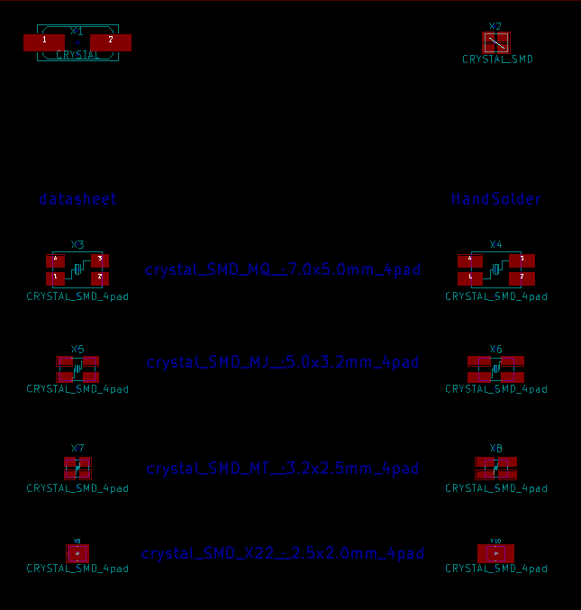
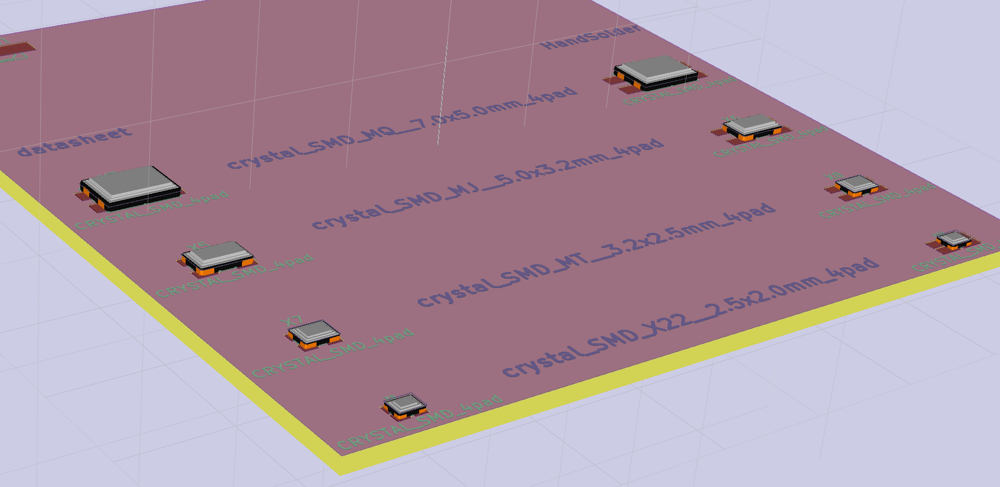
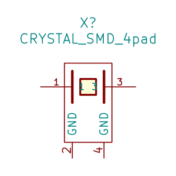

Crystals_Oscillators_SMD.pretty
===============================

content:  
- crystal_FA238-TSX3225 (old)
- Q_49U3HMS (old)
- crystal_SMD_MQ__7.0x5.0mm_4pad
- crystal_SMD_MQ__7.0x5.0mm_4pad_HandSoldering
- crystal_SMD_MJ__5.0x3.2mm_4pad
- crystal_SMD_MJ__5.0x3.2mm_4pad_HandSoldering
- crystal_SMD_MT__3.2x2.5mm_4pad
- crystal_SMD_MT__3.2x2.5mm_4pad_HandSoldering
- crystal_SMD_X22__2.5x2.0mm_4pad
- crystal_SMD_X22__2.5x2.0mm_4pad_HandSoldering

additional there is a Eeschema lib with an fitting `crystal_SMD_4pad` symbol:  

